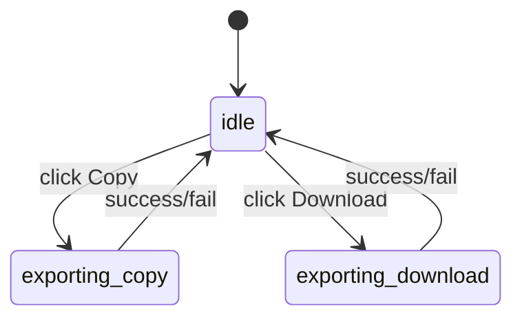

# 设计文档 - PromptRay 视觉与导出改造

## 架构概览
本次改动集中在：
- `components/PromptModal.tsx` 的 `AestheticCard`（视觉与导出）
- `index.html` 的导出安全模式 CSS（已存在，使用 data 属性联动）

## 组件分层与职责

### 1) AestheticCard（预览大卡片）
- **职责**：
  - 渲染标题（渐变文字）、类别信息、System Instruction 卡片、Prompt Code 卡片
  - 渲染背景/装饰层（可在导出时弱化）
  - 提供导出按钮：Copy as Image / Download as Image
  - 在导出时切换 `data-exporting="true"` 状态用于 CSS 安全模式
- **关键点**：
  - 标题渐变只作用于 `h1 > span.bg-clip-text.text-transparent.bg-gradient-to-r`（不可在导出时被覆盖）
  - 装饰层统一标记 `data-decorative-layer="true"`，导出时可统一降不透明度/饱和度
  - 外框统一标记 `data-export-frame="true"`，导出时弱化边框/阴影

### 2) index.html（全局样式）
- **职责**：
  - 定义主题变量、全局玻璃面板、动画
  - 定义导出安全模式（仅影响装饰/外框）：
    - `[data-exporting="true"] [data-decorative-layer="true"]`
    - `[data-exporting="true"] [data-export-frame="true"]`

## 数据流与状态机

### 导出状态
- `isExporting: boolean`：是否处于导出中
- `exportMode: 'copy' | 'download' | null`：当前导出模式

### 状态转换（简化）

### 交互与反馈
- **Copy**：只有在 `exportMode === 'copy'` 时显示 loading/高亮
- **Download**：只有在 `exportMode === 'download'` 时显示 loading/高亮
- **互斥**：导出中 `isExporting=true` 时两按钮均 disabled，但仅当前按钮显示 loading，从视觉上避免“双按钮一起运行”的错觉

## 导出安全模式策略
- 导出期间：
  - `data-exporting="true"`：挂在 card root（或 card root 有 data 属性）
  - 所有背景/渐变/orb 等装饰层：`data-decorative-layer="true"`
  - 外框/阴影强调层：`data-export-frame="true"`
- 禁止：
  - 改标题 span 的颜色、text-fill、filter blur
  - 给文字加遮罩导致发灰/模糊

