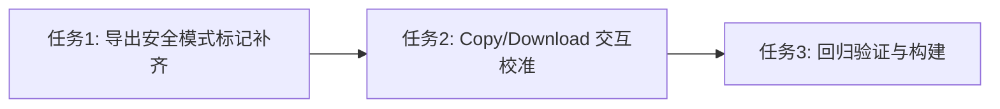

# 任务拆分文档 - PromptRay 视觉与导出改造

## 任务列表

### 任务1：导出安全模式标记补齐（decorative + frame）
#### 输入契约
- 前置依赖：`index.html` 已存在 `[data-exporting]` 安全样式
- 输入数据：`components/PromptModal.tsx` 的 `AestheticCard`

#### 输出契约
- 交付物：代码改动（AestheticCard 增加 data 标记）
- 验收标准：
  - 导出期间装饰层明显变淡，但标题/正文不变色、不变糊
  - 导出图片外框/阴影弱化

#### 实现约束
- 只给背景/装饰层添加 `data-decorative-layer="true"`
- 外框容器加 `data-export-frame="true"`
- 不触碰标题 span 的渐变实现

---

### 任务2：Copy/Download 交互互斥与视觉反馈校准
#### 输入契约
- AestheticCard 已有 `isExporting` + `exportMode`
- DOM：Copy 按钮 `data-action-button="copy"`，Download 按钮 `data-action-button="download"`

#### 输出契约
- 验收标准：
  - 点击 Copy 只触发 Copy；点击 Download 只触发 Download
  - 导出中：只有当前按钮显示 loading，高亮明确；另一个仅禁用灰态

---

### 任务3：回归验证与构建
#### 输出契约
- `npm run build` 通过
- 手测：导出图片构图一致、文字清晰、装饰不过度抢戏

## 依赖关系图

