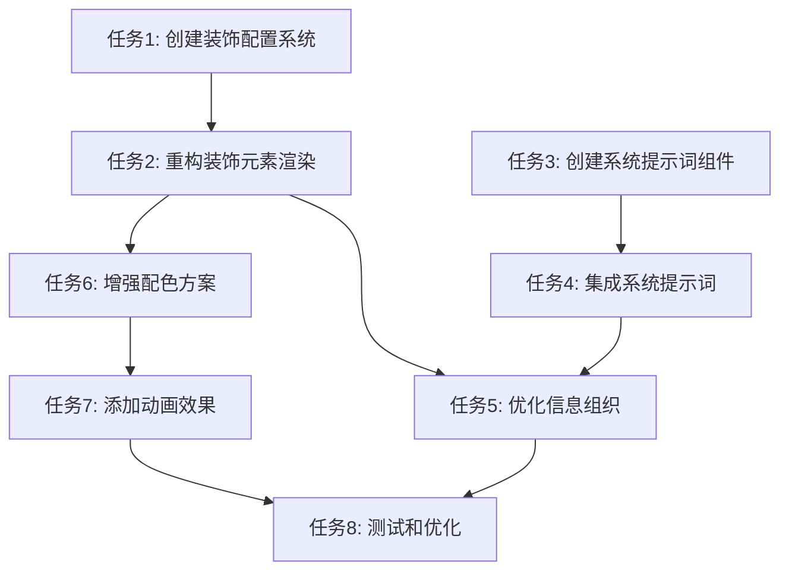

# 任务拆分文档 - 内圈样式重构

## 任务列表

### 任务1：创建装饰元素配置系统
#### 输入契约
- 前置依赖：无
- 输入数据：`currentThemeId` (string)
- 环境依赖：React, TypeScript

#### 输出契约
- 输出数据：装饰元素配置数组 `DecorativeOrbConfig[]`
- 交付物：`getThemeDecorativeConfig()` 函数
- 验收标准：
  - 函数返回正确的配置数组
  - 支持所有5个主题
  - 配置包含位置、尺寸、颜色等信息

#### 实现约束
- 技术栈：TypeScript, React
- 接口规范：函数签名符合设计文档
- 质量要求：类型安全，无any类型

#### 依赖关系
- 后置任务：任务2（使用此配置渲染装饰元素）

---

### 任务2：重构装饰元素渲染（多层次系统）
#### 输入契约
- 前置依赖：任务1完成
- 输入数据：装饰配置数组，`currentThemeId`
- 环境依赖：React, Tailwind CSS

#### 输出契约
- 输出数据：渲染的多层次装饰元素JSX
- 交付物：重构后的装饰元素渲染代码
- 验收标准：
  - 至少3层装饰元素
  - 视觉层次清晰
  - 响应式适配正常

#### 实现约束
- 技术栈：React, Tailwind CSS
- 接口规范：保持现有组件结构
- 质量要求：性能优化，使用GPU加速

#### 依赖关系
- 前置任务：任务1
- 后置任务：任务3（系统提示词集成）

---

### 任务3：创建系统提示词卡片组件
#### 输入契约
- 前置依赖：无（可并行）
- 输入数据：`systemInstruction` (string), `currentThemeId`, `isLightTheme`
- 环境依赖：React, TypeScript, Icons组件

#### 输出契约
- 输出数据：系统提示词卡片JSX组件
- 交付物：`SystemInstructionCard` 组件
- 验收标准：
  - 组件正确渲染系统提示词
  - 样式与主代码块区分明显
  - 支持所有主题

#### 实现约束
- 技术栈：React, TypeScript, Tailwind CSS
- 接口规范：组件props符合设计文档
- 质量要求：条件渲染（仅在存在时显示）

#### 依赖关系
- 后置任务：任务4（集成到预览卡片）

---

### 任务4：集成系统提示词到预览卡片
#### 输入契约
- 前置依赖：任务3完成
- 输入数据：`data.systemInstruction`, 其他现有props
- 环境依赖：React, 现有预览卡片组件

#### 输出契约
- 输出数据：包含系统提示词的完整预览卡片
- 交付物：更新后的 `AestheticPreviewCard` 组件
- 验收标准：
  - 系统提示词正确显示在代码块上方
  - 布局协调，间距合理
  - 条件渲染正常工作

#### 实现约束
- 技术栈：React, TypeScript
- 接口规范：不修改组件props接口
- 质量要求：向后兼容，无系统提示词时正常显示

#### 依赖关系
- 前置任务：任务3
- 后置任务：任务5（优化信息组织）

---

### 任务5：优化信息组织和视觉层次
#### 输入契约
- 前置依赖：任务2, 任务4完成
- 输入数据：所有内容元素（标题、描述、系统提示词、主提示词）
- 环境依赖：React, Tailwind CSS

#### 输出契约
- 输出数据：优化后的内容布局
- 交付物：更新后的内容区域布局代码
- 验收标准：
  - 信息层次清晰（4级层次）
  - 间距遵循8px网格系统
  - 视觉引导明确

#### 实现约束
- 技术栈：React, Tailwind CSS
- 接口规范：保持现有结构
- 质量要求：响应式适配，可读性良好

#### 依赖关系
- 前置任务：任务2, 任务4
- 后置任务：任务6（增强配色）

---

### 任务6：增强配色方案和渐变效果
#### 输入契约
- 前置依赖：任务2完成
- 输入数据：`currentThemeId`, 装饰配置
- 环境依赖：React, CSS

#### 输出契约
- 输出数据：增强的配色和渐变效果
- 交付物：更新的装饰元素样式
- 验收标准：
  - 至少3个层次的色彩
  - 渐变效果丰富自然
  - 所有主题配色协调

#### 实现约束
- 技术栈：CSS, Tailwind CSS
- 接口规范：使用设计文档中的配色映射
- 质量要求：性能优化，避免过度复杂

#### 依赖关系
- 前置任务：任务2
- 后置任务：任务7（添加动画）

---

### 任务7：添加微妙的动画效果（可选）
#### 输入契约
- 前置依赖：任务2, 任务6完成
- 输入数据：装饰元素配置
- 环境依赖：CSS, React

#### 输出契约
- 输出数据：带动画的装饰元素
- 交付物：CSS动画定义和动画类
- 验收标准：
  - 动画流畅自然
  - 性能影响可接受
  - 支持 `prefers-reduced-motion`

#### 实现约束
- 技术栈：CSS动画
- 接口规范：使用CSS关键帧
- 质量要求：性能优化，GPU加速

#### 依赖关系
- 前置任务：任务2, 任务6
- 后置任务：任务8（测试和优化）

---

### 任务8：测试和优化
#### 输入契约
- 前置依赖：所有任务完成
- 输入数据：完整的预览卡片组件
- 环境依赖：浏览器，html2canvas

#### 输出契约
- 输出数据：测试报告，优化后的代码
- 交付物：功能测试结果，性能测试结果
- 验收标准：
  - 所有功能正常工作
  - 导出功能正常
  - 响应式正常
  - 性能达标

#### 实现约束
- 技术栈：手动测试，浏览器DevTools
- 接口规范：符合验收标准
- 质量要求：无严重bug，性能良好

#### 依赖关系
- 前置任务：所有其他任务

## 依赖关系图

## 执行顺序

### Phase 1: 核心功能（必须）
1. 任务1 → 任务2（装饰元素重构）
2. 任务3 → 任务4（系统提示词集成）

### Phase 2: 视觉增强（重要）
3. 任务5（信息组织优化）
4. 任务6（配色增强）

### Phase 3: 细节优化（可选）
5. 任务7（动画效果）
6. 任务8（测试优化）

## 复杂度评估

- **任务1**: 低复杂度（配置函数）
- **任务2**: 中复杂度（多层渲染）
- **任务3**: 低复杂度（独立组件）
- **任务4**: 低复杂度（集成）
- **任务5**: 中复杂度（布局优化）
- **任务6**: 中复杂度（配色系统）
- **任务7**: 低复杂度（CSS动画）
- **任务8**: 中复杂度（全面测试）

## 风险控制

- 每个任务完成后立即验证
- 保留原有代码逻辑，便于回滚
- 分阶段提交，便于问题定位

